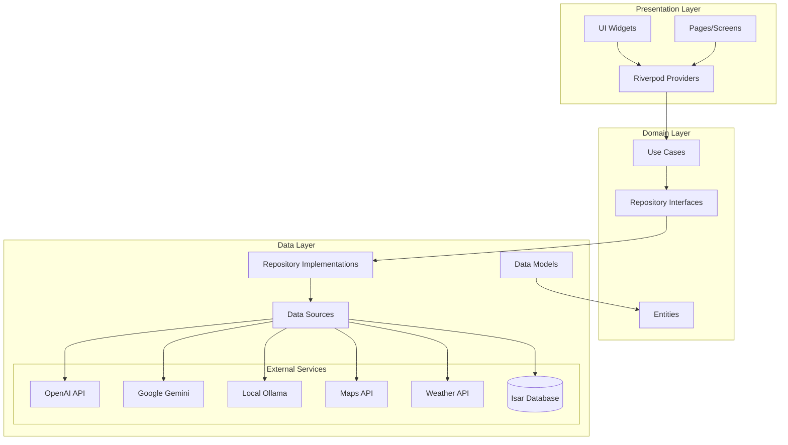
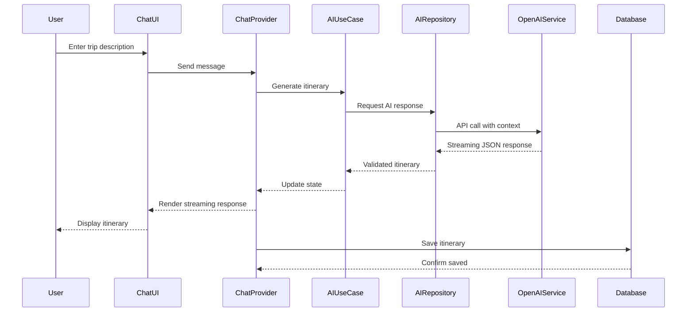
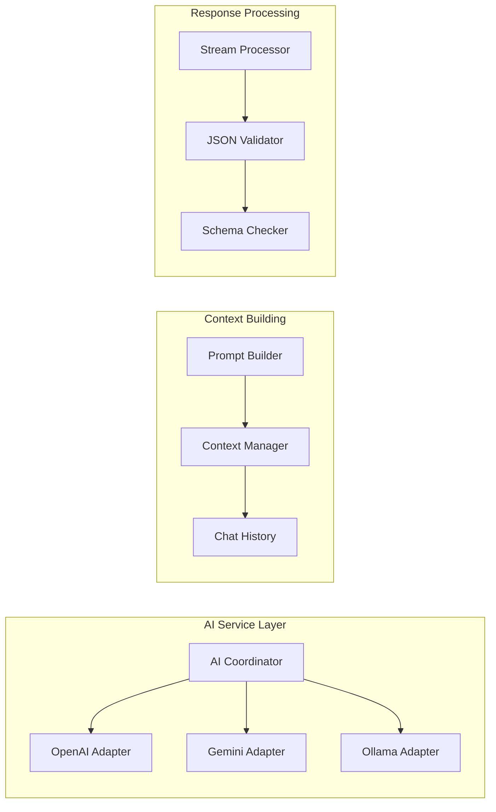
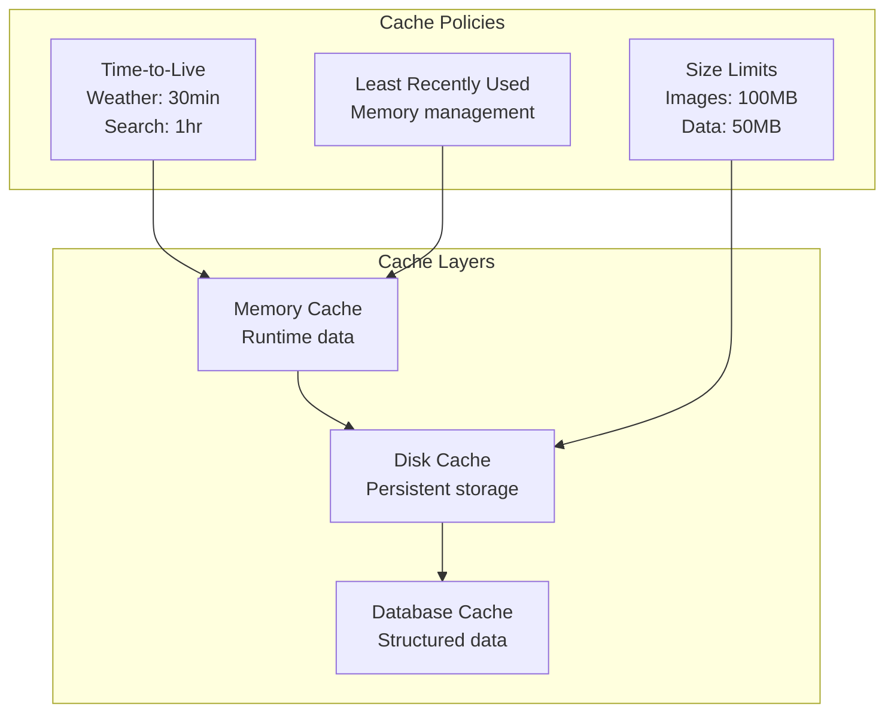
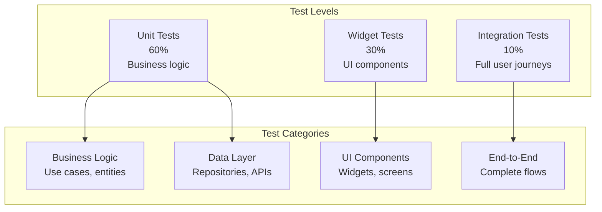
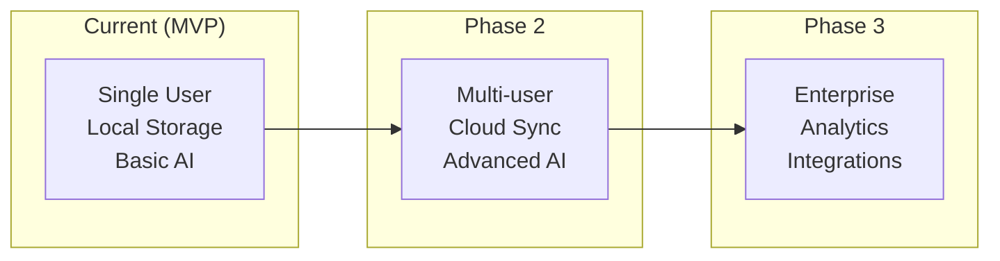

# Smart Trip Planner - Architecture Documentation

## 🏗️ System Overview

The Smart Trip Planner follows a **Clean Architecture** pattern with clear separation of concerns across three main layers:

1. **Presentation Layer**: UI components, state management, and user interactions
2. **Domain Layer**: Business logic, entities, and use cases
3. **Data Layer**: API calls, local storage, and data models



## 📱 Application Flow

### User Journey & Data Flow



## 🧩 Component Architecture

### 1. Presentation Layer

**State Management (Riverpod)**
```dart
// Provider hierarchy
AppProvider
├── ThemeProvider
├── RouterProvider
├── ChatProvider
├── ItineraryProvider
└── SettingsProvider
```

**Screen Structure**
```
presentation/
├── pages/
│   ├── splash_page.dart          # App initialization
│   ├── home_page.dart            # Main dashboard
│   ├── chat_page.dart            # AI conversation
│   └── itinerary_details_page.dart # Trip details
├── widgets/
│   ├── chat/                     # Chat-specific widgets
│   ├── itinerary/               # Itinerary components
│   └── common/                  # Reusable widgets
└── providers/
    ├── chat_provider.dart        # Chat state management
    ├── itinerary_provider.dart   # Trip data management
    └── ai_provider.dart          # AI service coordination
```

### 2. Domain Layer

**Core Entities**
```dart
// Business objects (pure Dart classes)
class TripItinerary {
  final String title;
  final DateTime startDate;
  final DateTime endDate;
  final List<DayPlan> days;
}

class DayPlan {
  final String date;
  final String summary;
  final List<ItineraryItem> items;
}

class ChatMessage {
  final String content;
  final bool isUser;
  final DateTime timestamp;
}
```

**Use Cases**
```dart
// Business logic encapsulation
class GenerateItineraryUseCase {
  Future<TripItinerary> execute(String userPrompt, TripItinerary? existing);
}

class SaveItineraryUseCase {
  Future<void> execute(TripItinerary itinerary);
}

class RefineItineraryUseCase {
  Future<TripItinerary> execute(String refinementPrompt, TripItinerary current);
}
```

### 3. Data Layer

**Repository Pattern**
```dart
abstract class ItineraryRepository {
  Future<List<TripItinerary>> getAllItineraries();
  Future<TripItinerary?> getItinerary(String id);
  Future<void> saveItinerary(TripItinerary itinerary);
  Future<void> deleteItinerary(String id);
}

abstract class AIRepository {
  Stream<String> generateItinerary(String prompt, Map<String, dynamic> context);
  Future<bool> validateResponse(String jsonResponse);
}
```

## 🤖 AI Agent Architecture

### LLM Integration Strategy



### Function Calling Implementation

```dart
// AI Tools/Functions available to LLMs
final tools = [
  {
    "name": "web_search",
    "description": "Search for real-time information about destinations",
    "parameters": {
      "type": "object",
      "properties": {
        "query": {"type": "string"},
        "location": {"type": "string"}
      }
    }
  },
  {
    "name": "get_weather",
    "description": "Get current weather for a location",
    "parameters": {
      "type": "object",
      "properties": {
        "location": {"type": "string"},
        "date": {"type": "string"}
      }
    }
  }
];
```

### Prompt Engineering Strategy

```typescript
// System prompt template
const SYSTEM_PROMPT = `
You are a travel planning expert AI. Generate detailed itineraries in JSON format.

Context:
- User's previous itinerary: {previous_itinerary}
- Chat history: {chat_history}
- Current request: {user_prompt}

Requirements:
1. Always respond with valid JSON matching the schema
2. Include specific times, locations (lat,lng), and descriptions
3. Consider local culture, weather, and practical logistics
4. Use web_search function for real-time information
5. Optimize for the specified trip style (budget, solo, family, etc.)

JSON Schema:
{schema}
`;
```

## 🗄️ Data Architecture

### Local Database (Isar)

```dart
// Database schema with relationships
@Collection()
class TripItinerary {
  Id id = Isar.autoIncrement;
  late String title;
  late DateTime startDate;
  late DateTime endDate;
  
  final days = IsarLinks<DayPlan>(); // One-to-many relationship
  final messages = IsarLinks<ChatMessage>(); // Chat history
}

@Collection()
class DayPlan {
  Id id = Isar.autoIncrement;
  late String date;
  late String summary;
  
  @Backlink(to: 'days')
  final itinerary = IsarLink<TripItinerary>();
  final items = IsarLinks<ItineraryItem>();
}
```

### Caching Strategy



## 🔌 External Integrations

### API Service Architecture

```dart
// Dio HTTP client configuration
class APIClient {
  static Dio createDio(String baseUrl) {
    final dio = Dio(BaseOptions(
      baseUrl: baseUrl,
      connectTimeout: Duration(seconds: 30),
      receiveTimeout: Duration(seconds: 60),
    ));
    
    dio.interceptors.addAll([
      AuthInterceptor(),      // API key injection
      RetryInterceptor(),     // Auto retry on failure
      CacheInterceptor(),     // Response caching
      LoggingInterceptor(),   // Request/response logging
    ]);
    
    return dio;
  }
}
```

### Service Interfaces

```dart
abstract class WeatherService {
  Future<Weather> getCurrentWeather(double lat, double lng);
  Future<List<Weather>> getForecast(double lat, double lng, int days);
}

abstract class SearchService {
  Future<List<SearchResult>> search(String query, String location);
  Future<List<PlaceInfo>> findNearbyPlaces(double lat, double lng, String type);
}

abstract class MapsService {
  Future<String> generateMapsUrl(double lat, double lng);
  Future<List<Route>> getDirections(LatLng from, LatLng to);
}
```

## 🧪 Testing Architecture

### Test Pyramid Strategy



### Mock Strategy

```dart
// Mock implementations for testing
class MockAIRepository implements AIRepository {
  @override
  Stream<String> generateItinerary(String prompt, Map<String, dynamic> context) {
    return Stream.fromIterable([
      '{"title": "Test Trip",',
      ' "days": [{"date": "2025-01-01",',
      ' "items": []}]}'
    ]).interval(Duration(milliseconds: 100));
  }
}
```

## 📊 Performance Considerations

### Memory Management

```dart
// Proper resource disposal
class ChatController extends StateNotifier<ChatState> {
  late StreamSubscription _aiResponseSubscription;
  late Timer _autosaveTimer;
  
  @override
  void dispose() {
    _aiResponseSubscription.cancel();
    _autosaveTimer.cancel();
    super.dispose();
  }
}
```

### Optimization Strategies

1. **Lazy Loading**: Load trip details only when accessed
2. **Image Caching**: Cache location images with size limits
3. **Background Processing**: Use isolates for heavy computations
4. **Memory Pools**: Reuse objects where possible
5. **Widget Optimization**: Use const constructors and keys

### Streaming Implementation

```dart
// Efficient streaming for real-time chat
class AIStreamProcessor {
  Stream<ItineraryUpdate> processAIStream(Stream<String> rawStream) async* {
    String buffer = '';
    
    await for (final chunk in rawStream) {
      buffer += chunk;
      
      // Try to parse complete JSON objects
      final updates = _extractCompleteObjects(buffer);
      for (final update in updates) {
        yield ItineraryUpdate.fromJson(update);
      }
    }
  }
}
```

## 🔒 Security Considerations

### API Key Management

```dart
// Secure API key handling
class SecurityConfig {
  static String getAPIKey(String service) {
    // Keys stored in secure storage or environment
    return dotenv.env['${service.toUpperCase()}_API_KEY'] ?? '';
  }
  
  static Map<String, String> getHeaders(String service) {
    return {
      'Authorization': 'Bearer ${getAPIKey(service)}',
      'Content-Type': 'application/json',
      'User-Agent': 'SmartTripPlanner/1.0',
    };
  }
}
```

### Data Privacy

- Local storage only (no cloud sync of personal data)
- API calls use minimal required data
- Chat history stored encrypted locally
- Location data never persisted without consent
- Token usage tracking anonymized

## 🚀 Deployment Architecture

### Build Pipeline

```yaml
# CI/CD Pipeline (GitHub Actions)
name: Build and Deploy
on: [push, pull_request]

jobs:
  test:
    runs-on: ubuntu-latest
    steps:
      - uses: actions/checkout@v3
      - uses: subosito/flutter-action@v2
      - run: flutter test --coverage
      - run: flutter analyze
  
  build:
    needs: test
    runs-on: ubuntu-latest
    steps:
      - run: flutter build apk --release
      - run: flutter build appbundle --release
      - run: flutter build web --release
```

### Monitoring & Analytics

```dart
// Performance monitoring
class PerformanceTracker {
  static void trackAIRequest(String model, int tokens, Duration latency) {
    // Track AI usage metrics
  }
  
  static void trackUserJourney(String screen, Duration timeSpent) {
    // Track user engagement
  }
  
  static void trackError(String error, Map<String, dynamic> context) {
    // Track and report errors
  }
}
```

## 📈 Scalability Considerations

### Future Enhancements

1. **Multi-language Support**: i18n integration
2. **Collaborative Planning**: Multi-user trip editing
3. **Advanced AI Features**: Image recognition, voice commands
4. **Social Features**: Trip sharing, reviews
5. **Enterprise Features**: Team planning, expense tracking

### Architecture Evolution



This architecture provides a solid foundation for the Smart Trip Planner while maintaining flexibility for future enhancements and scalability requirements.